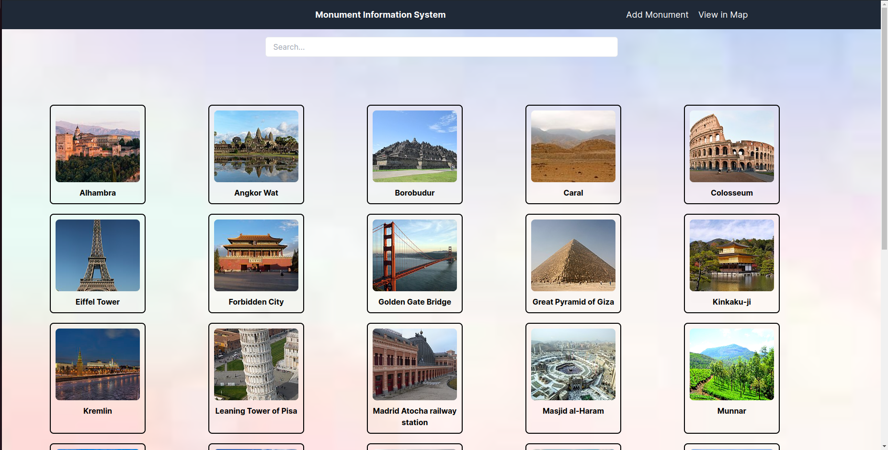
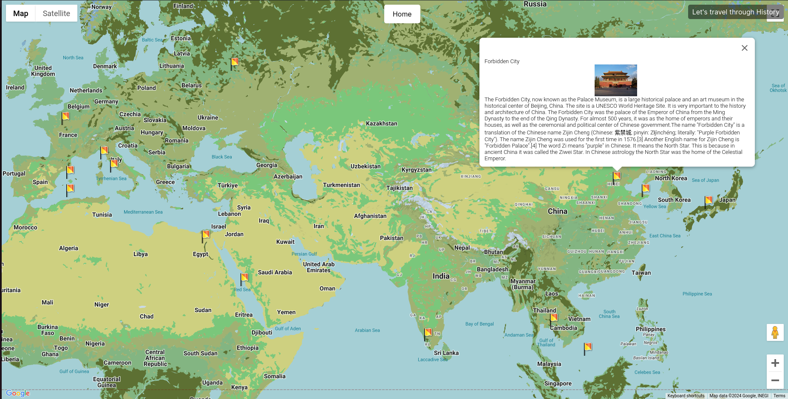
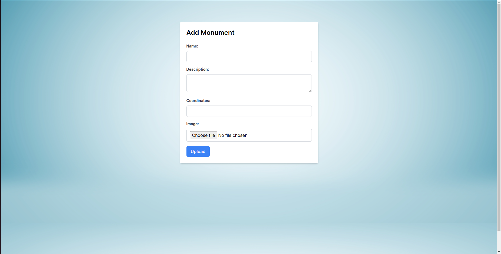

# Monument Information System

This project is a Monument Information System built using React and Next.js with Python for web scraping functionalities. It integrates Firebase for storage and Firestore database services, utilizes Tailwind CSS for styling, and incorporates Google Maps API for mapping functionalities. BeautifulSoup is used for scraping data from Wikipedia.

## Interface





## Getting Started

Follow these steps to get the project up and running on your local machine.

### Prerequisites

- Node.js
- Python 3
- npm (Node Package Manager)

### Installation

1. **Clone the repository:**

   ```bash
   git clone https://github.com/Sreeharij/Monument-Information-System/
   cd Monument-Information-System
2. **Install Python dependencies:**
   ```bash
   pip install -r requirements.txt
3. **Set up Firebase:**

   Configure firebase account and paste your "firebase_credentials.json" into the root directory for Firebase storage and Firestore database.
5. **Run Python setup script:**
   ```bash
   python3 setup.py
6. **Create .env.local file:**
  Create .env.local file at the root directory with the following data. Replace the corresponding values with your actual values.
   ```bash
    NEXT_PUBLIC_FIREBASE_API_KEY=your_firebase_api_key
    NEXT_PUBLIC_FIREBASE_AUTH_DOMAIN=your_firebase_auth_domain
    NEXT_PUBLIC_FIREBASE_PROJECT_ID=your_firebase_project_id
    NEXT_PUBLIC_FIREBASE_STORAGE_BUCKET=your_firebase_storage_bucket
    NEXT_PUBLIC_FIREBASE_MESSAGING_SENDER_ID=your_firebase_messaging_sender_id
    NEXT_PUBLIC_FIREBASE_APP_ID=your_firebase_app_id
    NEXT_PUBLIC_FIREBASE_MEASUREMENT_ID=your_firebase_measurement_id
    NEXT_PUBLIC_GMAP_API_KEY=your_google_maps_api_key
    NEXT_PUBLIC_PASSCODE=your_passcode
7. **Install npm dependencies:**
   ```bash
     npm install
8. **Run the development server:**
   ```bash
      npm run dev
Open http://localhost:3000 to view the app in your browser.


# Features

- **Firebase Integration:** Utilizes Firebase for storage and Firestore database services.
- **Google Maps API:** Integrates Google Maps API to display monument locations and details on a map.
- **Web Scraping:** Utilizes BeautifulSoup for scraping data from Wikipedia.
- **Responsive Design:** Designed using Tailwind CSS for a responsive and modern UI.

# License

This project is licensed under the GNU GENERAL PUBLIC LICENSE Version 3, 29 June 2007.
See the [LICENSE](LICENSE) file for details.
